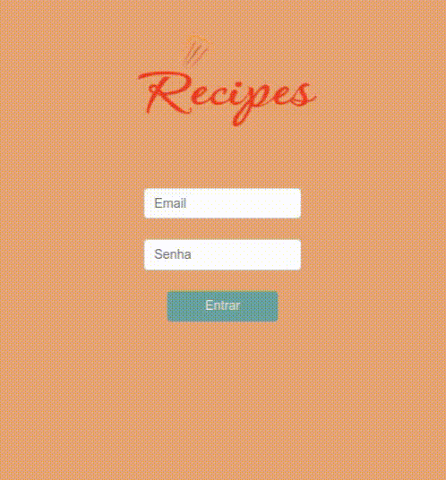

# Project Recipes
#### Este projeto faz parte da formação Full Stack da <a href="https://www.betrybe.com/">Trybe</a>.

## Introdução
Esta aplicação concentra receitas de comidas e bebidas vindas da API <a href="https://www.themealdb.com/api.php">TheMeallDB</a> e <a href="https://www.thecocktaildb.com/">TheCocktailDB</a>, respectivamente, onde o usuário terá as opções de:
  - Criar um login;
  - Visualizar receitas de comidas e bebidas;
  - Explorar receitas por ingrediente e local de origem;
  - Iniciar uma receita (o progresso é salvo), podendo curtir e compartilhar o seu link;
  - Visualizar todas as receitas curtidas e já realizadas.

## Habilidades
Neste projeto, foi utilizado Context API como gerenciador de estado e a biblioteca React Bootstrap para estilização.

## Desenvolvimento

### Tela Login


### Tela de Receitas


### Tela Explorar Receitas


### Tela Detalhes da Receita


### Tela de Iniciar a Receita


### Tela do Perfil do Usuário


Para iniciar o desenvolvimento, é necessário clonar o repositório do GitHub, acessar o projeto Recipes e intalar as dependências:
```shell
cd "diretorio de sua preferencia"

git clone git@github.com:gabrielmirandaBR/recipes-CRUD.git

cd recipes-CRUD

npm install

npm start
```
